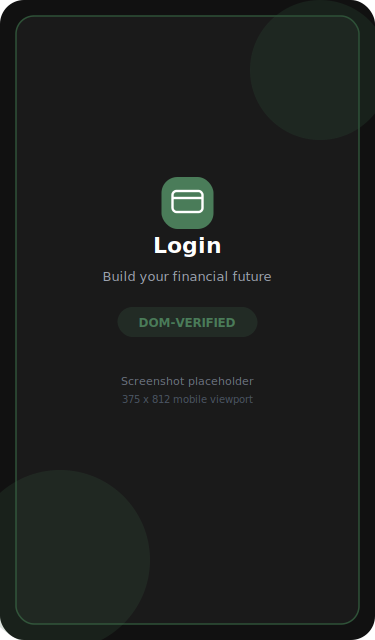
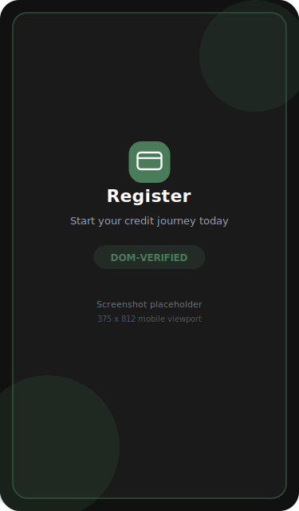
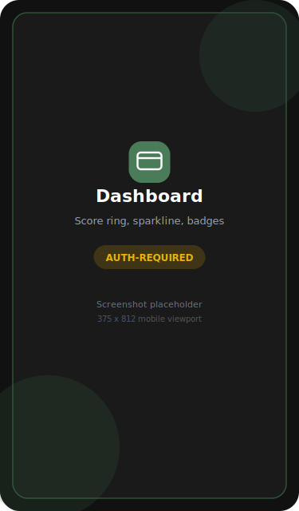
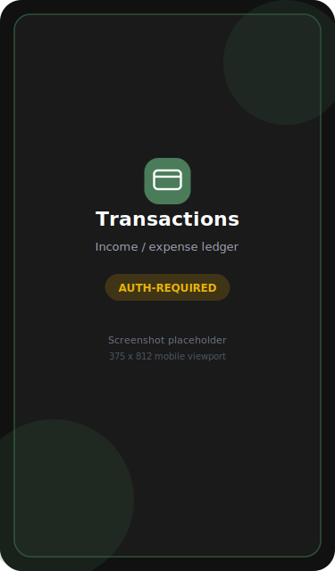
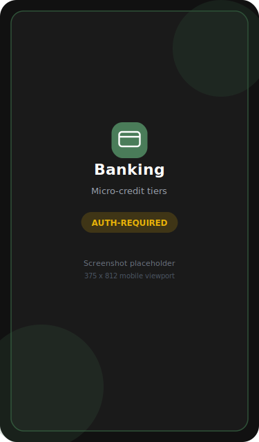
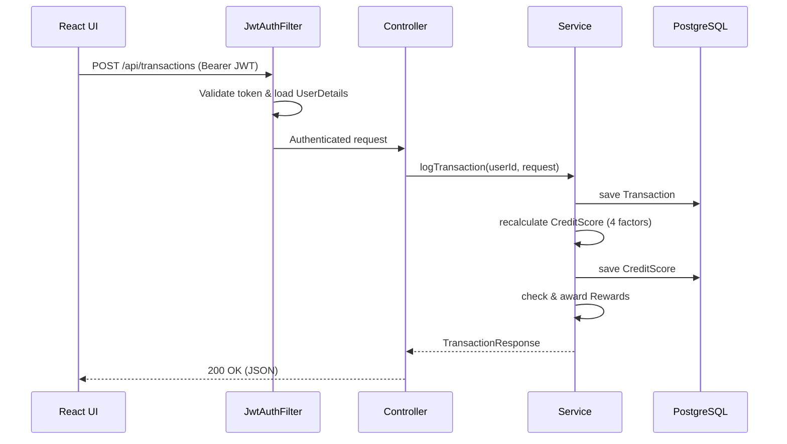
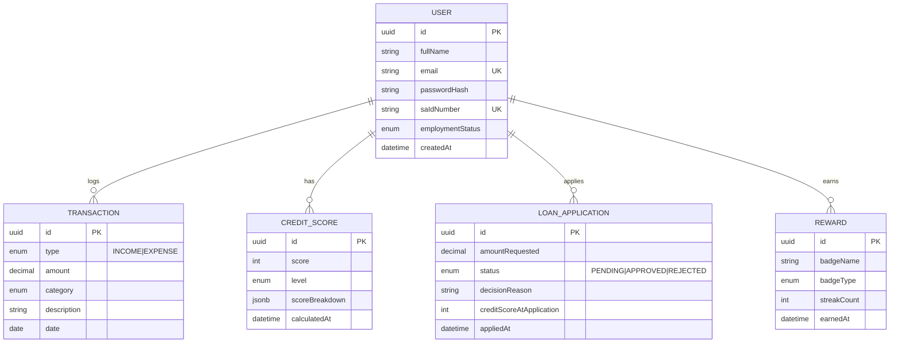
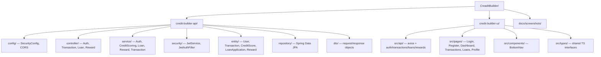

<div align="center">

# 💳 CreditBuilder

### Build credit through behaviour, not history.

A full-stack fintech app that gives the **credit-invisible** a real, data-driven credit score — earned by logging everyday income and expenses, not by having a borrowing past.

[](https://openjdk.org/)
[](https://spring.io/projects/spring-boot)
[](https://react.dev/)
[](https://vite.dev/)
[](https://www.typescriptlang.org/)
[](https://www.postgresql.org/)
[](https://jwt.io/)
[](#-license)

</div>

---

## 📑 Table of Contents

- [Overview](#-overview)
- [Screenshots](#-screenshots)
- [Features](#-features)
- [Tech Stack](#-tech-stack)
- [Architecture](#-architecture)
- [How the Credit Score Works](#-how-the-credit-score-works)
- [Data Model](#-data-model)
- [Folder Structure](#-folder-structure)
- [Getting Started](#-getting-started)
- [Environment Variables](#-environment-variables)
- [API Reference](#-api-reference)
- [Deployment](#-deployment)
- [Roadmap](#-roadmap)
- [Contributing](#-contributing)
- [License](#-license)

---

## 🌍 Overview

Traditional credit scores punish people who have **never borrowed** — students, gig workers, and the informally employed are "credit-invisible" even when they manage money responsibly.

**CreditBuilder** flips the model. Instead of asking *"have you had debt before?"*, it asks *"how do you handle the money you have?"* Users log their income and expenses, and a **behavioural scoring engine** turns that activity into a live credit score between **300 and 850**. The higher the score, the more gamified rewards and micro-credit tiers unlock.

Built with a South-African context in mind (ZAR currency, optional SA ID number, employment status), it is a mobile-first single-page app backed by a secure, stateless Spring Boot REST API.

> **Who it's for:** anyone building a credit reputation from scratch, and any team that wants a reference implementation of behavioural scoring, JWT auth, and a React 19 + Spring Boot 3 stack.

---

## 📸 Screenshots

> **Capture note:** The public **Login** and **Register** screens were rendered and **verified live** via the running Vite dev server (DOM/accessibility tree confirmed). The four authenticated screens require a booted backend + PostgreSQL, which was not reachable in the documentation environment, so they are shown as **labelled placeholders**. Replace the files in [`docs/screenshots/`](docs/screenshots) with real captures once the API is running locally.

| Login | Register | Dashboard |
| :---: | :---: | :---: |
|  |  |  |
| **Transactions** | **Banking / Loans** | **Profile** |
|  |  |  |

---

## ✨ Features

- 🔐 **JWT authentication** — stateless register/login with BCrypt-hashed passwords.
- 📊 **Behavioural credit score (300–850)** — recalculated in real time after every transaction from four weighted factors.
- 🧾 **Transaction ledger** — log income & expenses across 12 categories, grouped by date.
- 🏅 **Gamified rewards** — five earnable badges (First Step, Consistent Saver, Score Milestone, 4-Week Streak, Platinum Achiever).
- 🏦 **Tiered micro-credit** — score unlocks loan offers up to **R500**, with an instant auto-decision and reason.
- 📈 **Live dashboard** — animated score ring, factor breakdown, sparkline trend, and achievements.
- 📱 **Mobile-first UI** — custom Tailwind design system (sage/cream palette, DM Sans) with a bottom tab bar.
- ⚡ **Modern data layer** — TanStack Query caching + Axios interceptors that auto-attach the JWT and handle 401 logout.

---

## 🧰 Tech Stack

### Backend — `credit-builder-api`
| Concern | Choice |
| --- | --- |
| Language | **Java 17** |
| Framework | **Spring Boot 3.5.13** (Web, Data JPA, Security, Validation) |
| Auth | **JWT** via `io.jsonwebtoken` (jjwt 0.12.3), BCrypt |
| Persistence | **Spring Data JPA / Hibernate**, `ddl-auto=update` |
| Database | **PostgreSQL** (incl. `jsonb` for score breakdowns) |
| Build | **Maven** (wrapper included) |
| Boilerplate | **Lombok** |

### Frontend — `credit-builder-ui`
| Concern | Choice |
| --- | --- |
| Library | **React 19** |
| Tooling | **Vite 8** + **TypeScript 6** |
| Routing | **react-router-dom 7** |
| Server state | **TanStack React Query 5** |
| HTTP | **Axios** (with request/response interceptors) |
| Charts | **Recharts 3** |
| Styling | **Tailwind CSS 3** (custom theme) |

---

## 🏗 Architecture

```mermaid
flowchart LR
    subgraph Client["🖥️ credit-builder-ui — React 19 SPA"]
        Pages["Pages<br/>Login · Register · Dashboard<br/>Transactions · Loans · Profile"]
        RQ["TanStack Query<br/>cache + mutations"]
        AX["Axios instance<br/>JWT interceptor · 401 handler"]
        Pages --> RQ --> AX
    end

    subgraph API["☕ credit-builder-api — Spring Boot 3"]
        direction TB
        Filter["JwtAuthFilter<br/>(OncePerRequestFilter)"]
        Ctrls["REST Controllers<br/>Auth · Transaction · Loan · Reward"]
        Svcs["Services<br/>Auth · Transaction · CreditScoring · Loan · Reward"]
        Repos["Spring Data JPA Repositories"]
        Filter --> Ctrls --> Svcs --> Repos
    end

    DB[("🐘 PostgreSQL<br/>Users · Transactions<br/>CreditScore(jsonb) · Loans · Rewards")]

    AX -- "HTTPS + Bearer JWT<br/>/api/**" --> Filter
    Repos -- "JPA / Hibernate" --> DB
```



**Request lifecycle for a protected route:**



---

## 🧮 How the Credit Score Works

Every time a transaction is logged, `CreditScoringService` recomputes the score from a **base of 100 points** plus four behavioural factors, then **clamps the result between 300 and 850**. The full breakdown is stored as `jsonb` and shown on the dashboard.

| Factor | Max pts | Logic |
| --- | :---: | --- |
| **Base score** | 100 | Everyone starts here. |
| **Savings score** | 200 | Savings rate = (income − expenses) / income. **≥ 20% saved = full points**, scaled linearly below that. |
| **Consistency score** | 200 | Distinct expense categories used (last 90 days). **5+ categories = full points.** |
| **Streak score** | 200 | Distinct weeks with logged activity. **12+ weeks = full points.** |
| **Income score** | 150 | Distinct months with income (last 90 days). **3 months = full points.** |

**Levels are derived from the final score:**

| Level | Score range |
| --- | --- |
| 🟤 Beginner | &lt; 450 |
| 🥉 Bronze | 450 – 549 |
| 🥈 Silver | 550 – 649 |
| 🥇 Gold | 650 – 749 |
| 💎 Platinum | ≥ 750 |

**Loan auto-decision** (`LoanService`): score **≥ 751 → R500 approved**, **≥ 651 → R350 approved**, otherwise **rejected** with guidance to keep logging.

---

## 🗄 Data Model



---

## 📂 Folder Structure



<details>
<summary>Backend tree (click to expand)</summary>

```
credit-builder-api/
└── src/main/java/com/creditbuilder/api/
    ├── CreditBuilderApiApplication.java
    ├── config/         SecurityConfig.java
    ├── controller/     AuthController · TransactionController · LoanController · RewardController
    ├── dto/            AuthResponse · LoginRequest · RegisterRequest · TransactionRequest · TransactionResponse
    ├── entity/         User · Transaction · CreditScore · LoanApplication · Reward
    ├── repository/     UserRepository · TransactionRepository · CreditScoreRepository · LoanApplicationRepository · RewardRepository
    ├── security/       JwtService · JwtAuthFilter
    └── service/        AuthService · CustomUserDetailsService · TransactionService · CreditScoringService · LoanService · RewardService
    └── src/main/resources/application.properties
```
</details>

<details>
<summary>Frontend tree (click to expand)</summary>

```
credit-builder-ui/
├── index.html
├── vite.config.ts · tailwind.config.js · tsconfig*.json
└── src/
    ├── main.tsx            React root + Router + QueryClient
    ├── App.tsx             Routes + PrivateRoute guard
    ├── api/                axios.ts · auth.ts · transactions.ts · loans.ts · rewards.ts
    ├── pages/              LoginPage · RegisterPage · DashboardPage · TransactionsPage · LoansPage · ProfilePage
    ├── components/         BottomNav.tsx
    └── types/              index.ts
```
</details>

---

## 🚀 Getting Started

### Prerequisites
- **JDK 17+**
- **Node.js 18+** and npm
- **PostgreSQL 14+** running locally (or reachable remotely)

### 1. Clone

```bash
git clone <your-repo-url> CreaditBuilder
cd CreaditBuilder
```

### 2. Create the database

```sql
CREATE DATABASE creditbuilder;
```
Hibernate creates/updates the schema automatically (`spring.jpa.hibernate.ddl-auto=update`) — **no manual migrations required**.

### 3. Backend — `credit-builder-api`

Set the [required environment variables](#-environment-variables), then run the Maven wrapper:

```bash
cd credit-builder-api
# Windows
mvnw.cmd spring-boot:run
# macOS / Linux
./mvnw spring-boot:run
```
The API starts on **http://localhost:8080**. Sanity check:

```bash
curl http://localhost:8080/api/auth/test        # -> "Security is working!"
```

### 4. Frontend — `credit-builder-ui`

```bash
cd credit-builder-ui
npm install
npm run dev
```
Vite serves on **http://localhost:5173** (already whitelisted in the backend CORS config).

> **Heads-up:** `src/api/axios.ts` currently points `baseURL` at a deployed EC2 instance. For local development, change it to `http://localhost:8080/api`. Extracting this into a `VITE_API_URL` env var is on the [roadmap](#-roadmap).

---

## 🔑 Environment Variables

The backend **will not boot** until all five variables are set. Create a `.env` (or export them in your shell / IDE run config).

### `.env.example`

```dotenv
# --- PostgreSQL ---
DB_URL=jdbc:postgresql://localhost:5432/creditbuilder
DB_USERNAME=postgres
DB_PASSWORD=your_password_here

# --- JWT ---
# Secret must be long enough for HMAC-SHA (32+ chars / 256-bit recommended)
JWT_SECRET=change-me-to-a-long-random-256-bit-secret-value
# Token lifetime in milliseconds (e.g. 86400000 = 24h)
JWT_EXPIRATION=86400000
```

| Variable | Used by | Description |
| --- | --- | --- |
| `DB_URL` | `spring.datasource.url` | JDBC connection string to PostgreSQL. |
| `DB_USERNAME` | `spring.datasource.username` | Database user. |
| `DB_PASSWORD` | `spring.datasource.password` | Database password. |
| `JWT_SECRET` | `app.jwt.secret` | HMAC signing key for JWTs. Keep it long & secret. |
| `JWT_EXPIRATION` | `app.jwt.expiration` | Token validity in **milliseconds**. |

---

## 📡 API Reference

Base URL: `http://localhost:8080`  •  All `/api/auth/**` routes are **public**; everything else requires an `Authorization: Bearer <token>` header.

### 🔐 Auth — `/api/auth`

<details open>
<summary><b>POST</b> <code>/api/auth/register</code> — create an account</summary>

**Request**
```json
{
  "fullName": "Thabo Nkosi",
  "email": "thabo@gmail.com",
  "password": "demo1234",
  "saIdNumber": "0001015009087",
  "employmentStatus": "STUDENT"
}
```
**Response `200`**
```json
{
  "token": "eyJhbGciOiJIUzI1NiJ9...",
  "fullName": "Thabo Nkosi",
  "email": "thabo@gmail.com",
  "message": "Registration successful"
}
```
*Validations:* email format, password ≥ 8 chars, unique email & SA ID.
</details>

<details>
<summary><b>POST</b> <code>/api/auth/login</code> — authenticate</summary>

**Request**
```json
{ "email": "thabo@gmail.com", "password": "demo1234" }
```
**Response `200`** — same `AuthResponse` shape as register, with `"message": "Login successful"`.
</details>

<details>
<summary><b>GET</b> <code>/api/auth/test</code> — health/security check</summary>

**Response `200`**: `"Security is working!"`
</details>

### 🧾 Transactions — `/api/transactions` 🔒

<details>
<summary><b>POST</b> <code>/api/transactions</code> — log a transaction (triggers rescore + badge check)</summary>

**Request**
```json
{
  "type": "INCOME",
  "amount": 5000.00,
  "category": "SALARY",
  "description": "Monthly pay",
  "date": "2026-07-01"
}
```
**Response `200`**
```json
{
  "id": "b2c1...",
  "type": "INCOME",
  "amount": 5000.00,
  "category": "SALARY",
  "description": "Monthly pay",
  "date": "2026-07-01"
}
```
*Categories — income:* `SALARY, FREELANCE, ALLOWANCE, OTHER_INCOME` • *expense:* `FOOD, TRANSPORT, AIRTIME, ENTERTAINMENT, SAVINGS, EDUCATION, RENT, OTHER_EXPENSE`.
</details>

<details>
<summary><b>GET</b> <code>/api/transactions</code> — list my transactions (newest first)</summary>

**Response `200`**: array of `TransactionResponse` objects.
</details>

<details>
<summary><b>GET</b> <code>/api/transactions/score</code> — current credit score</summary>

**Response `200`**
```json
{
  "score": 640,
  "level": "SILVER",
  "breakdown": {
    "baseScore": 100,
    "savingsScore": 200,
    "consistencyScore": 120,
    "streakScore": 80,
    "incomeScore": 150
  },
  "calculatedAt": "2026-07-21T09:20:00"
}
```
Before any transaction exists, returns: `{ "message": "No score yet — log your first transaction!" }`.
</details>

### 🏦 Loans — `/api/loans` 🔒

<details>
<summary><b>POST</b> <code>/api/loans/apply</code> — apply for micro-credit (auto-decision)</summary>

Uses the user's latest credit score. **Response `200`**
```json
{
  "id": "9f3a...",
  "amountRequested": 350,
  "status": "APPROVED",
  "decisionReason": "Fair behavioral score. Entry-level credit granted",
  "creditScoreAtApplication": 660,
  "appliedAt": "2026-07-21T09:25:00"
}
```
</details>

<details>
<summary><b>GET</b> <code>/api/loans/my-applications</code> — my application history</summary>

**Response `200`**: array of `LoanApplication` objects, newest first.
</details>

### 🏅 Rewards — `/api/rewards` 🔒

<details>
<summary><b>GET</b> <code>/api/rewards/me</code> — my earned badges</summary>

**Response `200`**
```json
[
  { "id": "1a...", "badgeName": "First Step", "badgeType": "FIRST_TRANSACTION", "streakCount": 0, "earnedAt": "2026-07-10T08:00:00" }
]
```
</details>

---

## ☁️ Deployment

**Backend (Spring Boot → JAR):**
```bash
cd credit-builder-api
./mvnw clean package          # produces target/credit-builder-api-0.0.1-SNAPSHOT.jar
java -jar target/credit-builder-api-0.0.1-SNAPSHOT.jar
```
Provide the five env vars in the target environment (systemd unit, Docker `-e` flags, or your PaaS dashboard). The included CORS config already whitelists the production S3 origin `creditbuilder-ui-ezra.s3-website.af-south-1.amazonaws.com` alongside `localhost:5173`.

**Frontend (Vite → static site):**
```bash
cd credit-builder-ui
npm run build                 # outputs dist/
```
Host `dist/` on any static host — the project is set up for **AWS S3 static website hosting** (region `af-south-1`) with the API on **EC2**. Update `axios.ts` (or a future `VITE_API_URL`) to point at your API host, and ensure that origin is in the backend's allowed CORS list.

---

## 🗺 Roadmap

- [ ] Externalise the frontend API URL into `VITE_API_URL` (remove the hardcoded IP in `axios.ts`).
- [ ] Add a global `@RestControllerAdvice` so errors return structured JSON (`{ message, status }`) instead of raw 500s.
- [ ] Remove debug `System.out.println` / `printStackTrace` from `JwtAuthFilter` and `TransactionController`; switch to SLF4J logging.
- [ ] Replace `RuntimeException` throws with typed exceptions + proper HTTP status codes.
- [ ] Add a token-refresh flow and store the JWT more securely than `localStorage`.
- [ ] Score-history endpoint + real trend chart (replace the mocked dashboard sparkline).
- [ ] Automated tests: unit tests for `CreditScoringService`, integration tests for controllers.
- [ ] CI/CD pipeline (GitHub Actions) + Dockerfiles for API and UI.
- [ ] Tighten CORS from `@CrossOrigin(origins = "*")` on individual controllers to the central config only.

---

## 🤝 Contributing

1. Fork the repo and create a feature branch: `git checkout -b feature/my-feature`.
2. Commit your changes with clear messages.
3. Ensure the backend compiles (`./mvnw compile`) and the frontend lints (`npm run lint`).
4. Open a pull request describing the change.

---

## 📄 License

Released under the **MIT License**. See [`LICENSE`](LICENSE) for details.

<div align="center">

**CreditBuilder** — because responsible money habits *are* creditworthiness.

</div>
